# RDRA ダイアグラム

> `rdra.py diagrams` で表から生成。手で編集しない。点線・橙色は仮説。

## システムコンテキスト

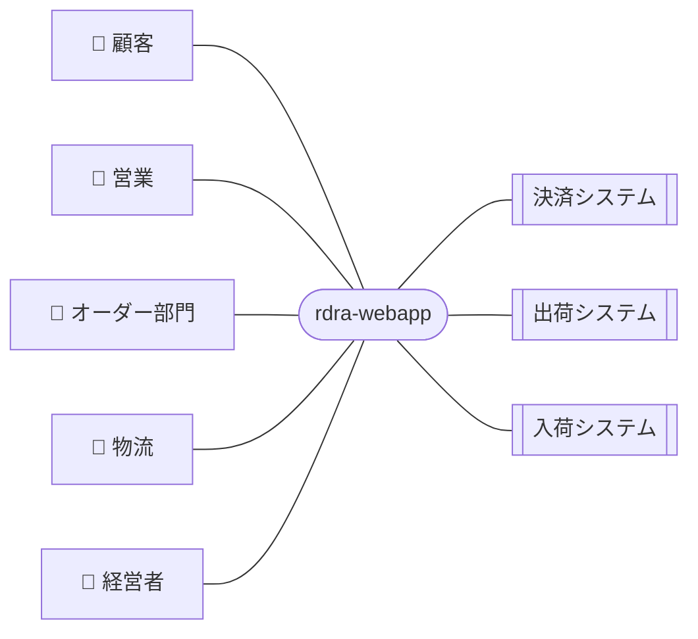
```mermaid
flowchart LR
  sys(["rdra-webapp"])
  a1["👤 顧客"] --- sys
  a2["👤 営業"] --- sys
  a3["👤 オーダー部門"] --- sys
  a4["👤 物流"] --- sys
  a5["👤 経営者"] --- sys
  sys --- e6[["決済システム"]]
  sys --- e7[["出荷システム"]]
  sys --- e8[["入荷システム"]]
  classDef hyp stroke-dasharray:5 5,stroke:#d97706,color:#92400e
```

## 要求モデル

```mermaid
flowchart LR
  g1{{"G-01 輸入した商品をタイムリーに紹介し、Web で顧客に直接販売する"}}
  g2{{"G-02 顧客と直接つながり、商品に対する顧客の声をダイレクトに把握して商品開発につなげる"}}
  r3["R-01 [機能] 顧客が Web で商品を選び、決済情報と送付先を入力して購入できる"]
  g1 --> r3
  r4["R-02 [機能] 営業が仕入れた商品を Web の取り扱い商品として登録・削除できる"]
  g1 --> r4
  r5["R-03 [機能] 顧客がオーダー商品の現在の状態を確認できる"]
  g1 --> r5
  r6["R-04 [機能] 顧客が会員登録できる。会員登録しなくても購入できる"]
  g1 --> r6
  g2 --> r6
  r7["R-05 [機能] 顧客が出荷前のオーダーを Web でキャンセルできる"]
  g1 --> r7
  r8["R-06 [機能] 決済システムの入金情報通知を受けてオーダーと照合し、照合できないもの・金額が異なるものだけオーダー部門が確認する"]
  g1 --> r8
  r9["R-07 [機能] 出荷指示の前にオーダー別の在庫を確認し、在庫切れのオーダーを入荷待ちにする"]
  g1 --> r9
  r10["R-08 [機能] 入荷システムから送られる入荷情報で、入荷待ちのオーダーの入荷待ちを解除する"]
  g1 --> r10
  r11["R-09 [機能] 入金が確認されたオーダーの出荷指示を、そのまま出荷システムへ連携する"]
  g1 --> r11
  r12["R-10 [機能] 取引先への発注(在庫切れ時の追加発注、新規商品の発注)を記録する"]
  g1 --> r12
  r13["R-11 [機能] 営業が商品の特性と売れた時期・売れた場所を管理し、売れた場所をマップ上に表示できる"]
  g1 --> r13
  r14["R-12 [機能] 売上を週単位で集計し、月単位でも見られる"]
  g1 --> r14
  r15["R-13 [機能] 購入した顧客が商品のレビュー・感想を Web で投稿できる"]
  g2 --> r15
  r16["R-14 [機能] 営業が商品ごとにレビュー・感想を集計し、商品開発の検討に使える"]
  g2 --> r16
  r17["R-15 [機能] 営業が、今後追加発注しない在庫商品をマークし、売れ筋商品の在庫量を多くできる"]
  g1 --> r17
  r18["R-16 [機能] 経営者が売上の状況を見られる"]
  g1 -.-> r18
  r19["R-17 [機能] 多様な顧客のニーズに沿えるように、入金手段を多く用意する"]
  g1 --> r19
  r20["R-18 [ポリシー] オーダー処理は新たに用意するオーダー部門に集約し、営業は戦略的な商品管理の仕事にシフトする"]
  r21["R-19 [非機能] 保守性を考え、使用する技術を統一する"]
  g1 --> r21
  r22["R-20 [ポリシー] 直営店と Web の在庫は共有しない。直営店での販売・店舗の在庫は対象外"]
  r23["R-21 [機能] オーダーを受理したことと支払い方法を顧客にメールで通知する"]
  g1 --> r23
  r24["R-22 [ポリシー] 入金額が不足する場合は差額の追加支払いを依頼し、多すぎる場合は差額を返金する"]
  r25["R-23 [ポリシー] 返品はオーダー部門がメールもしくは電話で受け付ける"]
  r26["R-24 [機能] オーダー部門が配送会社からの配送終了のメール通知を確認し、オーダーを完了にできる"]
  g1 --> r26
  r27["R-25 [ポリシー] 出荷は朝・昼・夕方の各3時間単位の締め毎に行う"]
  b28(["会員登録する"])
  r6 -.-> b28
  b29(["注文を受け付ける"])
  r3 --> b29
  r19 --> b29
  r5 --> b29
  b30(["オーダーを受理する"])
  r20 --> b30
  r23 --> b30
  b31(["入金を確認して出荷を指示する"])
  r3 --> b31
  r23 --> b31
  r19 --> b31
  r8 --> b31
  r9 --> b31
  r22 --> b31
  r11 --> b31
  b32(["入荷したオーダーの出荷を指示する"])
  r10 --> b32
  r11 --> b32
  b33(["配送終了を確認してオーダーを完了する"])
  r26 --> b33
  b34(["出荷前のオーダーをキャンセルする"])
  r7 --> b34
  r24 -.-> b34
  b35(["入金差異を解消する"])
  r8 --> b35
  r24 --> b35
  b36(["返品を受け付ける"])
  r25 --> b36
  b37(["締め毎に出荷する"])
  r11 --> b37
  r27 --> b37
  r22 --> b37
  b38(["在庫切れの商品を追加発注する"])
  r12 --> b38
  b39(["新規商品を発注する"])
  r12 --> b39
  b40(["入荷を発注と突き合わせる"])
  r10 --> b40
  r12 --> b40
  r22 --> b40
  b41(["取り扱い商品を登録・削除する"])
  r4 --> b41
  b42(["追加発注しない在庫商品をマークする"])
  r17 --> b42
  b43(["売れ筋商品の在庫量を多くする"])
  r17 --> b43
  b44(["週単位で売上を分析し品揃えを検討する"])
  r13 --> b44
  r14 --> b44
  b45(["売上の状況を見る"])
  r18 -.-> b45
  b46(["レビュー・感想を投稿する"])
  r15 --> b46
  b47(["レビュー・感想を集計し商品開発に使う"])
  r16 --> b47
  classDef hyp stroke-dasharray:5 5,stroke:#d97706,color:#92400e
  class r18 hyp
```

## ビジネスコンテキスト

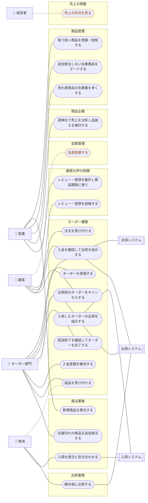
```mermaid
flowchart LR
  subgraph g1["会員管理"]
    b2(["会員登録する"])
  end
  subgraph g3["オーダー業務"]
    b4(["注文を受け付ける"])
    b5(["オーダーを受理する"])
    b6(["入金を確認して出荷を指示する"])
    b7(["入荷したオーダーの出荷を指示する"])
    b8(["配送終了を確認してオーダーを完了する"])
    b9(["出荷前のオーダーをキャンセルする"])
    b10(["入金差異を解消する"])
    b11(["返品を受け付ける"])
  end
  subgraph g12["出荷業務"]
    b13(["締め毎に出荷する"])
  end
  subgraph g14["発注業務"]
    b15(["在庫切れの商品を追加発注する"])
    b16(["新規商品を発注する"])
    b17(["入荷を発注と突き合わせる"])
  end
  subgraph g18["商品管理"]
    b19(["取り扱い商品を登録・削除する"])
    b20(["追加発注しない在庫商品をマークする"])
    b21(["売れ筋商品の在庫量を多くする"])
  end
  subgraph g22["商品企画"]
    b23(["週単位で売上を分析し品揃えを検討する"])
  end
  subgraph g24["売上の把握"]
    b25(["売上の状況を見る"])
  end
  subgraph g26["顧客の声の把握"]
    b27(["レビュー・感想を投稿する"])
    b28(["レビュー・感想を集計し商品開発に使う"])
  end
  a29["👤 顧客"] -.- b2
  a29["👤 顧客"] --- b4
  a30["👤 オーダー部門"] --- b5
  a29["👤 顧客"] --- b6
  a30["👤 オーダー部門"] --- b6
  b6 --- e31[["決済システム"]]
  b6 --- e32[["出荷システム"]]
  a30["👤 オーダー部門"] --- b7
  b7 --- e33[["入荷システム"]]
  b7 --- e32[["出荷システム"]]
  a30["👤 オーダー部門"] --- b8
  a29["👤 顧客"] --- b9
  a30["👤 オーダー部門"] -.- b9
  a30["👤 オーダー部門"] --- b10
  a30["👤 オーダー部門"] --- b11
  a34["👤 物流"] -.- b11
  a34["👤 物流"] --- b13
  b13 --- e32[["出荷システム"]]
  a30["👤 オーダー部門"] --- b15
  a35["👤 営業"] --- b16
  a34["👤 物流"] --- b17
  b17 --- e33[["入荷システム"]]
  a35["👤 営業"] --- b19
  a35["👤 営業"] --- b20
  a35["👤 営業"] --- b21
  a35["👤 営業"] --- b23
  a36["👤 経営者"] -.- b25
  a29["👤 顧客"] --- b27
  a35["👤 営業"] --- b28
  classDef hyp stroke-dasharray:5 5,stroke:#d97706,color:#92400e
  class b2,b25 hyp
```

## 業務フロー

### 会員管理

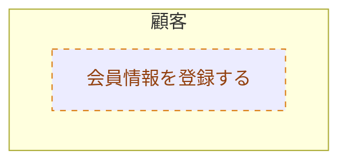
```mermaid
flowchart TB
  subgraph l1["顧客"]
    act2["会員情報を登録する"]
  end
  classDef hyp stroke-dasharray:5 5,stroke:#d97706,color:#92400e
  class act2 hyp
```

### オーダー業務

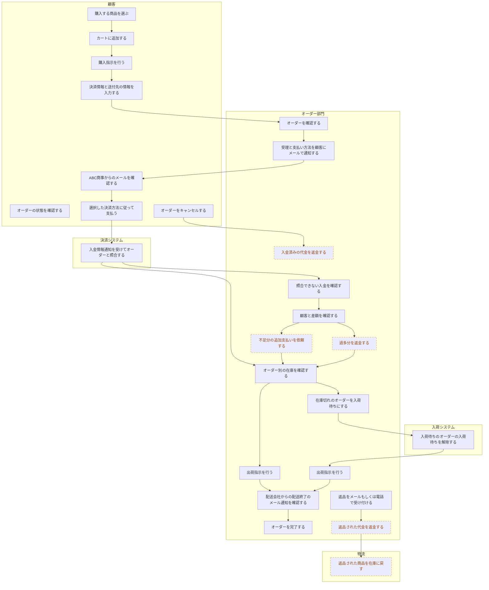
```mermaid
flowchart TB
  subgraph l1["顧客"]
    act2["購入する商品を選ぶ"]
    act3["カートに追加する"]
    act4["購入指示を行う"]
    act5["決済情報と送付先の情報を入力する"]
    act6["オーダーの状態を確認する"]
    act7["ABC商事からのメールを確認する"]
    act8["選択した決済方法に従って支払う"]
    act9["オーダーをキャンセルする"]
  end
  subgraph l10["オーダー部門"]
    act11["オーダーを確認する"]
    act12["受理と支払い方法を顧客にメールで通知する"]
    act13["オーダー別の在庫を確認する"]
    act14["在庫切れのオーダーを入荷待ちにする"]
    act15["出荷指示を行う"]
    act16["出荷指示を行う"]
    act17["配送会社からの配送終了のメール通知を確認する"]
    act18["オーダーを完了する"]
    act19["入金済みの代金を返金する"]
    act20["照合できない入金を確認する"]
    act21["顧客と差額を確認する"]
    act22["不足分の追加支払いを依頼する"]
    act23["過多分を返金する"]
    act24["返品をメールもしくは電話で受け付ける"]
    act25["返品された代金を返金する"]
  end
  subgraph l26["決済システム"]
    act27["入金情報通知を受けてオーダーと照合する"]
  end
  subgraph l28["入荷システム"]
    act29["入荷待ちのオーダーの入荷待ちを解除する"]
  end
  subgraph l30["物流"]
    act31["返品された商品を在庫に戻す"]
  end
  act2 --> act3
  act3 --> act4
  act4 --> act5
  act5 --> act11
  act11 --> act12
  act12 --> act7
  act7 --> act8
  act8 --> act27
  act27 --> act13
  act27 --> act20
  act13 --> act14
  act13 --> act15
  act14 --> act29
  act15 --> act17
  act29 --> act16
  act16 --> act17
  act17 --> act18
  act9 --> act19
  act20 --> act21
  act21 --> act22
  act21 --> act23
  act22 --> act13
  act23 --> act13
  act24 --> act25
  act25 --> act31
  classDef hyp stroke-dasharray:5 5,stroke:#d97706,color:#92400e
  class act19,act22,act23,act25,act31 hyp
```

### 出荷業務

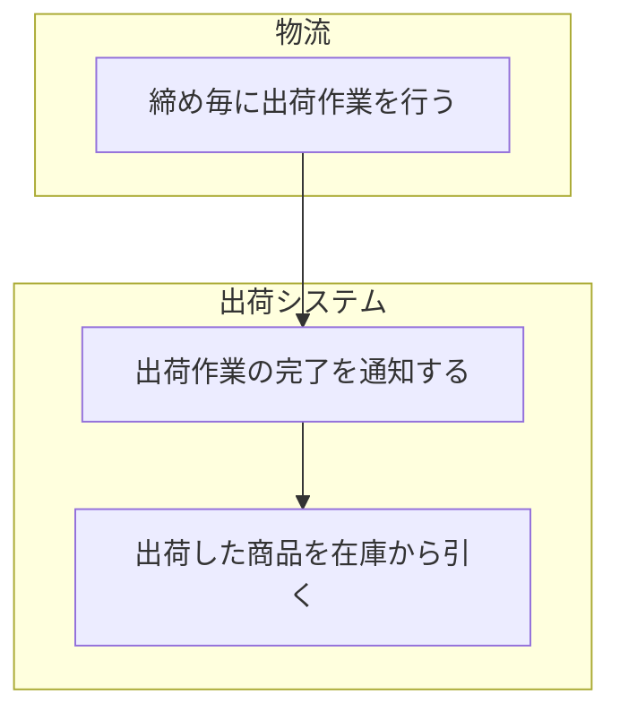
```mermaid
flowchart TB
  subgraph l1["物流"]
    act2["締め毎に出荷作業を行う"]
  end
  subgraph l3["出荷システム"]
    act4["出荷作業の完了を通知する"]
    act5["出荷した商品を在庫から引く"]
  end
  act2 --> act4
  act4 --> act5
  classDef hyp stroke-dasharray:5 5,stroke:#d97706,color:#92400e
```

### 発注業務

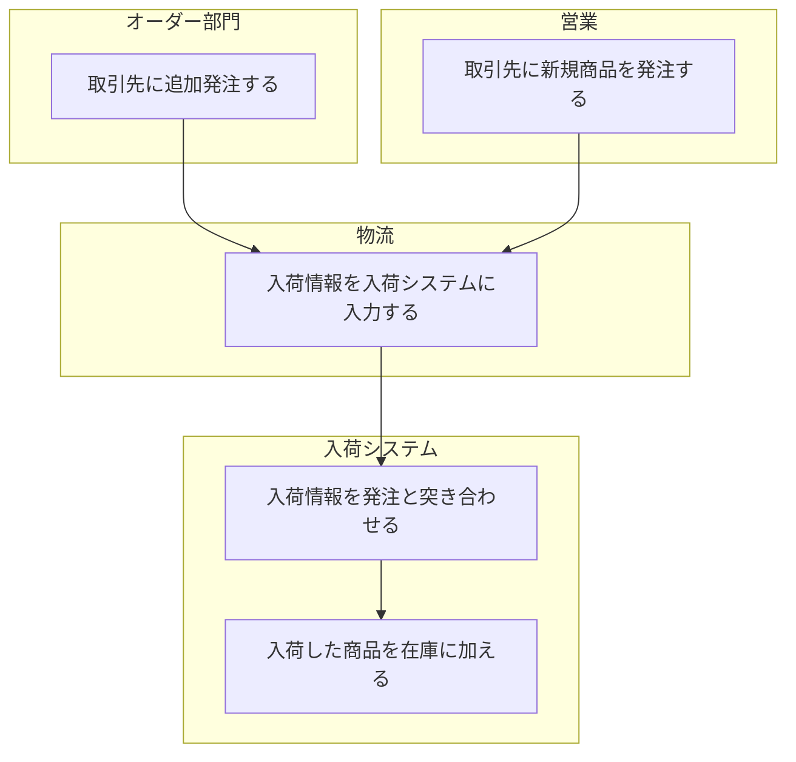
```mermaid
flowchart TB
  subgraph l1["オーダー部門"]
    act2["取引先に追加発注する"]
  end
  subgraph l3["営業"]
    act4["取引先に新規商品を発注する"]
  end
  subgraph l5["物流"]
    act6["入荷情報を入荷システムに入力する"]
  end
  subgraph l7["入荷システム"]
    act8["入荷情報を発注と突き合わせる"]
    act9["入荷した商品を在庫に加える"]
  end
  act2 --> act6
  act4 --> act6
  act6 --> act8
  act8 --> act9
  classDef hyp stroke-dasharray:5 5,stroke:#d97706,color:#92400e
```

### 商品管理

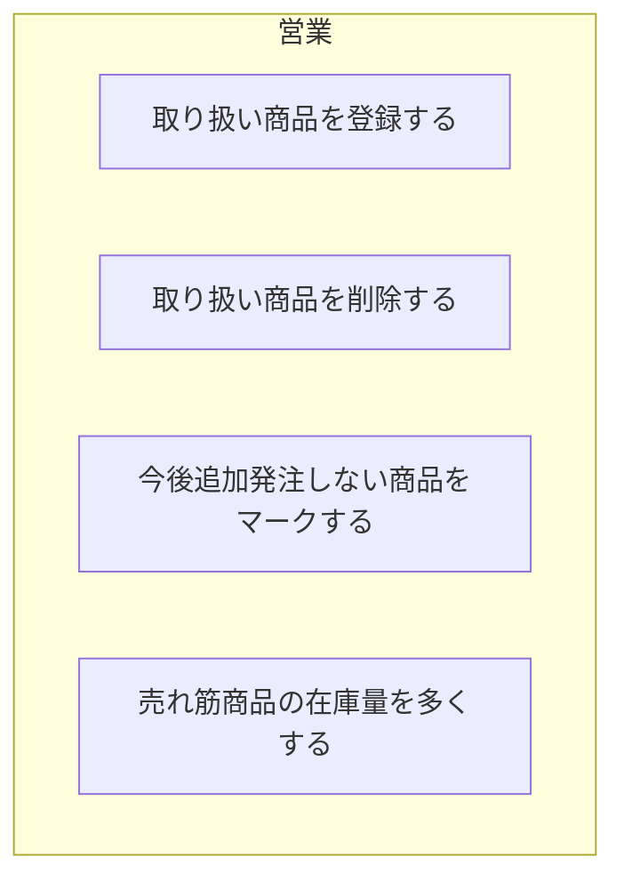
```mermaid
flowchart TB
  subgraph l1["営業"]
    act2["取り扱い商品を登録する"]
    act3["取り扱い商品を削除する"]
    act4["今後追加発注しない商品をマークする"]
    act5["売れ筋商品の在庫量を多くする"]
  end
  classDef hyp stroke-dasharray:5 5,stroke:#d97706,color:#92400e
```

### 商品企画

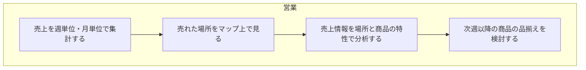
```mermaid
flowchart TB
  subgraph l1["営業"]
    act2["売上を週単位・月単位で集計する"]
    act3["売れた場所をマップ上で見る"]
    act4["売上情報を場所と商品の特性で分析する"]
    act5["次週以降の商品の品揃えを検討する"]
  end
  act2 --> act3
  act3 --> act4
  act4 --> act5
  classDef hyp stroke-dasharray:5 5,stroke:#d97706,color:#92400e
```

### 売上の把握

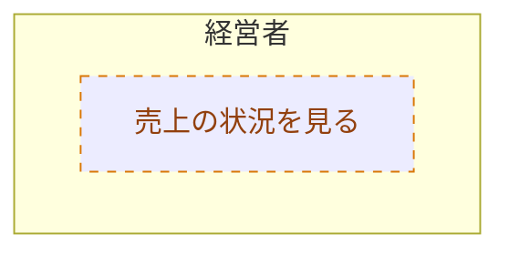
```mermaid
flowchart TB
  subgraph l1["経営者"]
    act2["売上の状況を見る"]
  end
  classDef hyp stroke-dasharray:5 5,stroke:#d97706,color:#92400e
  class act2 hyp
```

### 顧客の声の把握

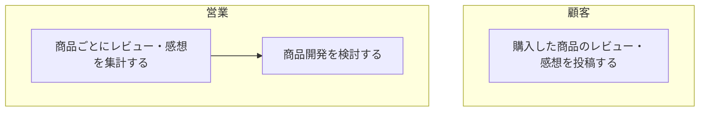
```mermaid
flowchart TB
  subgraph l1["顧客"]
    act2["購入した商品のレビュー・感想を投稿する"]
  end
  subgraph l3["営業"]
    act4["商品ごとにレビュー・感想を集計する"]
    act5["商品開発を検討する"]
  end
  act4 --> act5
  classDef hyp stroke-dasharray:5 5,stroke:#d97706,color:#92400e
```

## BUCごとのアクティビティ

### 会員管理 / 会員登録する

```mermaid
flowchart TB
  subgraph l1["顧客"]
    act2["会員情報を登録する"]
  end
  classDef hyp stroke-dasharray:5 5,stroke:#d97706,color:#92400e
  class act2 hyp
```

### オーダー業務 / 注文を受け付ける

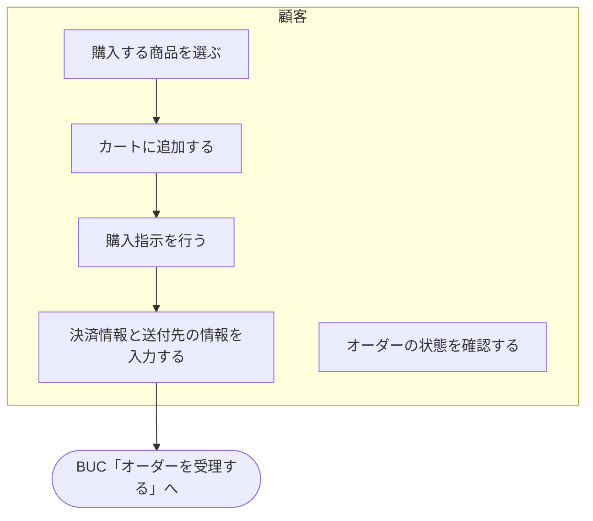
```mermaid
flowchart TB
  subgraph l1["顧客"]
    act2["購入する商品を選ぶ"]
    act3["カートに追加する"]
    act4["購入指示を行う"]
    act5["決済情報と送付先の情報を入力する"]
    act6["オーダーの状態を確認する"]
  end
  act2 --> act3
  act3 --> act4
  act4 --> act5
  act5 --> to7(["BUC「オーダーを受理する」へ"])
  classDef hyp stroke-dasharray:5 5,stroke:#d97706,color:#92400e
```

### オーダー業務 / オーダーを受理する

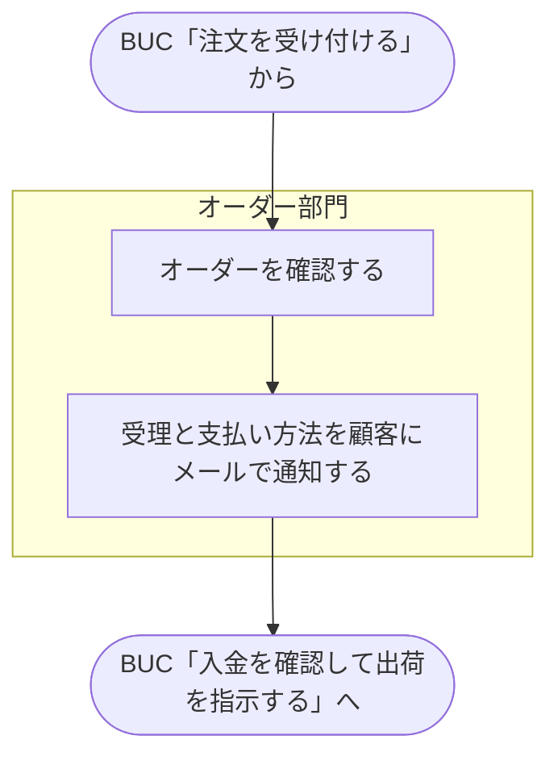
```mermaid
flowchart TB
  subgraph l1["オーダー部門"]
    act2["オーダーを確認する"]
    act3["受理と支払い方法を顧客にメールで通知する"]
  end
  from4(["BUC「注文を受け付ける」から"]) --> act2
  act2 --> act3
  act3 --> to5(["BUC「入金を確認して出荷を指示する」へ"])
  classDef hyp stroke-dasharray:5 5,stroke:#d97706,color:#92400e
```

### オーダー業務 / 入金を確認して出荷を指示する

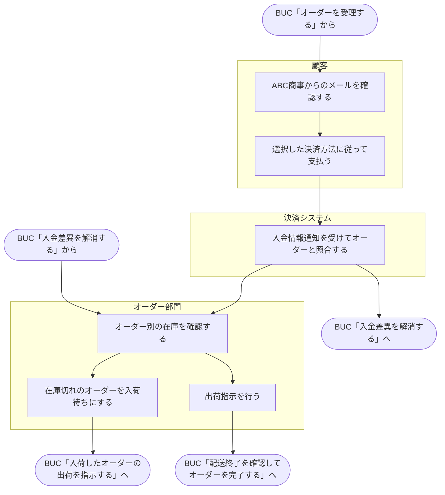
```mermaid
flowchart TB
  subgraph l1["顧客"]
    act2["ABC商事からのメールを確認する"]
    act3["選択した決済方法に従って支払う"]
  end
  subgraph l4["決済システム"]
    act5["入金情報通知を受けてオーダーと照合する"]
  end
  subgraph l6["オーダー部門"]
    act7["オーダー別の在庫を確認する"]
    act8["在庫切れのオーダーを入荷待ちにする"]
    act9["出荷指示を行う"]
  end
  from10(["BUC「オーダーを受理する」から"]) --> act2
  act2 --> act3
  act3 --> act5
  act5 --> act7
  act5 --> to11(["BUC「入金差異を解消する」へ"])
  act7 --> act8
  act7 --> act9
  act8 --> to12(["BUC「入荷したオーダーの出荷を指示する」へ"])
  act9 --> to13(["BUC「配送終了を確認してオーダーを完了する」へ"])
  from14(["BUC「入金差異を解消する」から"]) --> act7
  classDef hyp stroke-dasharray:5 5,stroke:#d97706,color:#92400e
```

### オーダー業務 / 入荷したオーダーの出荷を指示する

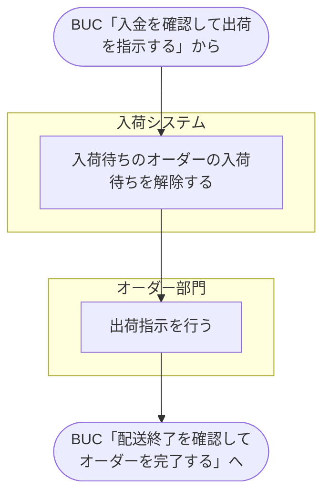
```mermaid
flowchart TB
  subgraph l1["入荷システム"]
    act2["入荷待ちのオーダーの入荷待ちを解除する"]
  end
  subgraph l3["オーダー部門"]
    act4["出荷指示を行う"]
  end
  from5(["BUC「入金を確認して出荷を指示する」から"]) --> act2
  act2 --> act4
  act4 --> to6(["BUC「配送終了を確認してオーダーを完了する」へ"])
  classDef hyp stroke-dasharray:5 5,stroke:#d97706,color:#92400e
```

### オーダー業務 / 配送終了を確認してオーダーを完了する

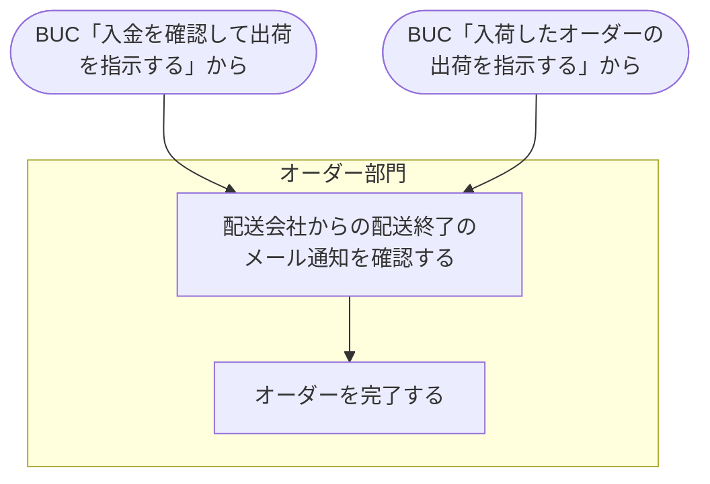
```mermaid
flowchart TB
  subgraph l1["オーダー部門"]
    act2["配送会社からの配送終了のメール通知を確認する"]
    act3["オーダーを完了する"]
  end
  from4(["BUC「入金を確認して出荷を指示する」から"]) --> act2
  from5(["BUC「入荷したオーダーの出荷を指示する」から"]) --> act2
  act2 --> act3
  classDef hyp stroke-dasharray:5 5,stroke:#d97706,color:#92400e
```

### オーダー業務 / 出荷前のオーダーをキャンセルする

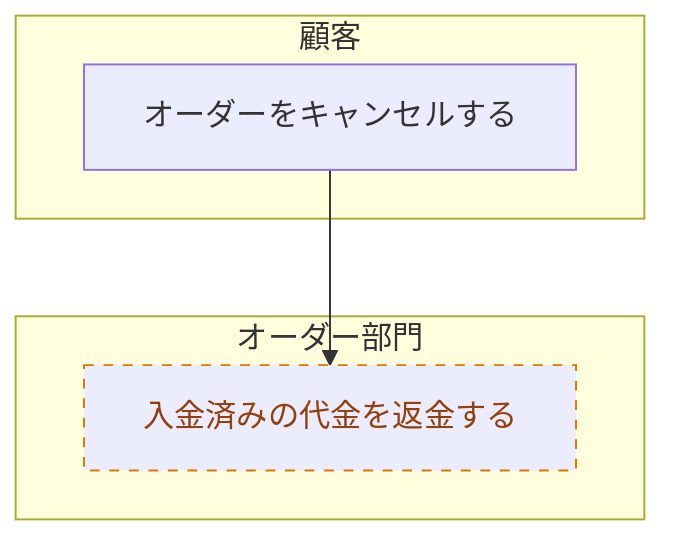
```mermaid
flowchart TB
  subgraph l1["顧客"]
    act2["オーダーをキャンセルする"]
  end
  subgraph l3["オーダー部門"]
    act4["入金済みの代金を返金する"]
  end
  act2 --> act4
  classDef hyp stroke-dasharray:5 5,stroke:#d97706,color:#92400e
  class act4 hyp
```

### オーダー業務 / 入金差異を解消する

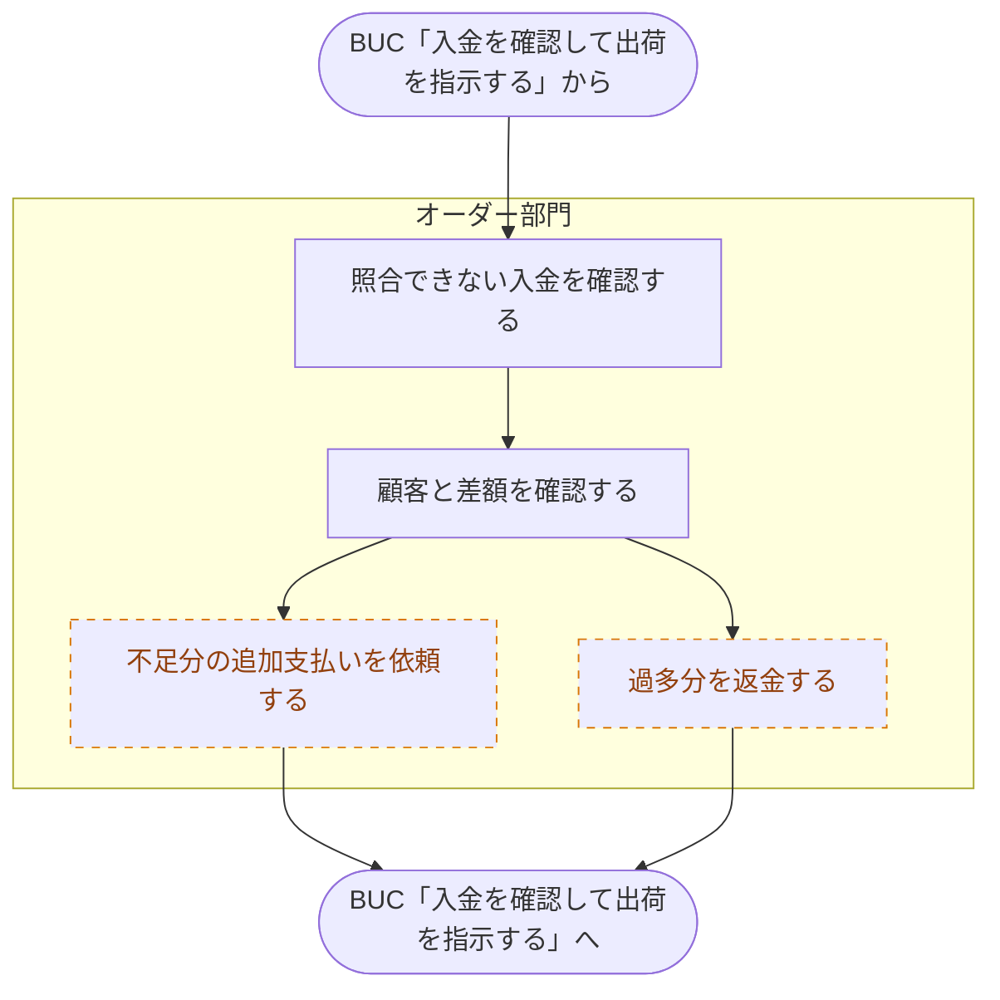
```mermaid
flowchart TB
  subgraph l1["オーダー部門"]
    act2["照合できない入金を確認する"]
    act3["顧客と差額を確認する"]
    act4["不足分の追加支払いを依頼する"]
    act5["過多分を返金する"]
  end
  from6(["BUC「入金を確認して出荷を指示する」から"]) --> act2
  act2 --> act3
  act3 --> act4
  act3 --> act5
  act4 --> to7(["BUC「入金を確認して出荷を指示する」へ"])
  act5 --> to7(["BUC「入金を確認して出荷を指示する」へ"])
  classDef hyp stroke-dasharray:5 5,stroke:#d97706,color:#92400e
  class act4,act5 hyp
```

### オーダー業務 / 返品を受け付ける

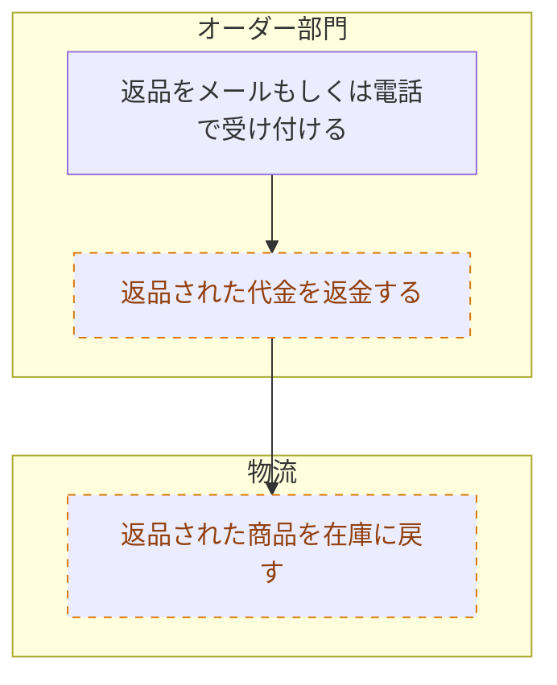
```mermaid
flowchart TB
  subgraph l1["オーダー部門"]
    act2["返品をメールもしくは電話で受け付ける"]
    act3["返品された代金を返金する"]
  end
  subgraph l4["物流"]
    act5["返品された商品を在庫に戻す"]
  end
  act2 --> act3
  act3 --> act5
  classDef hyp stroke-dasharray:5 5,stroke:#d97706,color:#92400e
  class act3,act5 hyp
```

### 出荷業務 / 締め毎に出荷する

```mermaid
flowchart TB
  subgraph l1["物流"]
    act2["締め毎に出荷作業を行う"]
  end
  subgraph l3["出荷システム"]
    act4["出荷作業の完了を通知する"]
    act5["出荷した商品を在庫から引く"]
  end
  act2 --> act4
  act4 --> act5
  classDef hyp stroke-dasharray:5 5,stroke:#d97706,color:#92400e
```

### 発注業務 / 在庫切れの商品を追加発注する

```mermaid
flowchart TB
  subgraph l1["オーダー部門"]
    act2["取引先に追加発注する"]
  end
  act2 --> to3(["BUC「入荷を発注と突き合わせる」へ"])
  classDef hyp stroke-dasharray:5 5,stroke:#d97706,color:#92400e
```

### 発注業務 / 新規商品を発注する

```mermaid
flowchart TB
  subgraph l1["営業"]
    act2["取引先に新規商品を発注する"]
  end
  act2 --> to3(["BUC「入荷を発注と突き合わせる」へ"])
  classDef hyp stroke-dasharray:5 5,stroke:#d97706,color:#92400e
```

### 発注業務 / 入荷を発注と突き合わせる

```mermaid
flowchart TB
  subgraph l1["物流"]
    act2["入荷情報を入荷システムに入力する"]
  end
  subgraph l3["入荷システム"]
    act4["入荷情報を発注と突き合わせる"]
    act5["入荷した商品を在庫に加える"]
  end
  from6(["BUC「在庫切れの商品を追加発注する」から"]) --> act2
  from7(["BUC「新規商品を発注する」から"]) --> act2
  act2 --> act4
  act4 --> act5
  classDef hyp stroke-dasharray:5 5,stroke:#d97706,color:#92400e
```

### 商品管理 / 取り扱い商品を登録・削除する

```mermaid
flowchart TB
  subgraph l1["営業"]
    act2["取り扱い商品を登録する"]
    act3["取り扱い商品を削除する"]
  end
  classDef hyp stroke-dasharray:5 5,stroke:#d97706,color:#92400e
```

### 商品管理 / 追加発注しない在庫商品をマークする

```mermaid
flowchart TB
  subgraph l1["営業"]
    act2["今後追加発注しない商品をマークする"]
  end
  classDef hyp stroke-dasharray:5 5,stroke:#d97706,color:#92400e
```

### 商品管理 / 売れ筋商品の在庫量を多くする

```mermaid
flowchart TB
  subgraph l1["営業"]
    act2["売れ筋商品の在庫量を多くする"]
  end
  classDef hyp stroke-dasharray:5 5,stroke:#d97706,color:#92400e
```

### 商品企画 / 週単位で売上を分析し品揃えを検討する

```mermaid
flowchart TB
  subgraph l1["営業"]
    act2["売上を週単位・月単位で集計する"]
    act3["売れた場所をマップ上で見る"]
    act4["売上情報を場所と商品の特性で分析する"]
    act5["次週以降の商品の品揃えを検討する"]
  end
  act2 --> act3
  act3 --> act4
  act4 --> act5
  classDef hyp stroke-dasharray:5 5,stroke:#d97706,color:#92400e
```

### 売上の把握 / 売上の状況を見る

```mermaid
flowchart TB
  subgraph l1["経営者"]
    act2["売上の状況を見る"]
  end
  classDef hyp stroke-dasharray:5 5,stroke:#d97706,color:#92400e
  class act2 hyp
```

### 顧客の声の把握 / レビュー・感想を投稿する

```mermaid
flowchart TB
  subgraph l1["顧客"]
    act2["購入した商品のレビュー・感想を投稿する"]
  end
  classDef hyp stroke-dasharray:5 5,stroke:#d97706,color:#92400e
```

### 顧客の声の把握 / レビュー・感想を集計し商品開発に使う

```mermaid
flowchart TB
  subgraph l1["営業"]
    act2["商品ごとにレビュー・感想を集計する"]
    act3["商品開発を検討する"]
  end
  act2 --> act3
  classDef hyp stroke-dasharray:5 5,stroke:#d97706,color:#92400e
```

## 情報モデル

```mermaid
erDiagram
  %% コンテキスト: 商品
  i1["商品"]
  %% コンテキスト: 顧客
  i2["顧客"]
  %% コンテキスト: オーダー
  i3["カート"]
  i4["オーダー"]
  i5["入金"]
  i6["返品"]
  %% コンテキスト: 在庫
  i7["在庫"]
  i8["出荷指示"]
  i9["入荷"]
  %% コンテキスト: 発注
  i10["発注"]
  i11["取引先"]
  %% コンテキスト: 販売分析
  i12["売上"]
  %% コンテキスト: 顧客の声
  i13["レビュー"]
```

## 状態モデル

### オーダー状態

```mermaid
stateDiagram-v2
  state "受付済" as s1
  state "受理済" as s2
  state "入金待ち" as s3
  state "入金確認済" as s4
  state "入金差異あり" as s5
  state "入荷待ち" as s6
  state "出荷指示済" as s7
  state "出荷済" as s8
  state "完了" as s9
  state "キャンセル済" as s10
  state "返品受付済" as s11
  classDef hyp stroke-dasharray:5 5,stroke:#d97706,color:#92400e
  class s1,s3 hyp
```

### 商品状態

```mermaid
stateDiagram-v2
  state "取扱中" as s1
  state "追加発注しない" as s2
  state "取扱終了" as s3
```

### 発注状態

```mermaid
stateDiagram-v2
  state "発注済" as s1
  state "入荷済" as s2
```

### 出荷指示状態

```mermaid
stateDiagram-v2
  state "指示済" as s1
  state "出荷済" as s2
```

### 顧客状態

```mermaid
stateDiagram-v2
  state "非会員" as s1
  state "会員" as s2
  classDef hyp stroke-dasharray:5 5,stroke:#d97706,color:#92400e
  class s1,s2 hyp
```
